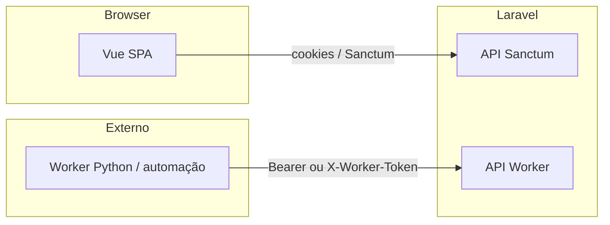

# Portal SAP Bot — documentação geral

Este ficheiro serve para **retomar contexto** se o assistente (agente) fechar ou se outra pessoa entrar no projeto. Atualiza-o quando a arquitetura ou o fluxo mudarem de forma relevante.

---

## 1. O que é o projeto

**Nome no código / UI:** “Bot SAP”.

- **Painel web (SPA):** Vue 3 — login, dashboard, configuração de bots, cargas, execuções e logs.
- **API Laravel:** expõe endpoints para o painel (com **Laravel Sanctum**) e para um **worker externo** (Python ou outro processo) que executa o bot e reporta estado via token dedicado.

**Caminho típico no PC (Laragon):** `C:\laragon\www\portal-sap-bot`

---

## 2. Stack

| Camada | Tecnologia |
|--------|------------|
| Backend | PHP 8.2+, Laravel 12 |
| Auth API | Laravel Sanctum (`auth:sanctum`) |
| Base de dados | Por defeito **SQLite** (`database/database.sqlite`) — configurável no `.env` |
| Frontend | Vue 3, Vue Router 4, Vite 5, Tailwind CSS 4 |
| HTTP cliente (SPA) | Axios |
| Filas / sessão / cache | Configuráveis; `.env.example` sugere `database` para queue, session e cache |

---

## 3. Estrutura de pastas (essencial)

```
portal-sap-bot/
├── app/Http/Controllers/Api/     # Controladores da API REST
├── app/Http/Middleware/
│   └── WorkerToken.php           # Valida token do worker
├── app/Models/                   # Bot, Parametro, Carga, Execucao, BotLog, User
├── config/services.php           # `services.worker.token` ← WORKER_API_TOKEN
├── database/migrations/          # Schema bots, parametros, cargas, execucoes, bot_logs, users…
├── routes/
│   ├── api.php                   # API + prefixo implícito /api
│   └── web.php                   # SPA catch-all → view `app`
├── resources/
│   ├── js/
│   │   ├── app.js
│   │   ├── router/index.js     # Rotas Vue + guard de auth
│   │   ├── pages/               # Login, Dashboard, Config, Cargas, Execucoes, Logs
│   │   ├── layouts/MainLayout.vue
│   │   └── composables/         # useAuth.js, useTheme.js
│   └── views/app.blade.php      # Shell HTML que carrega Vite
└── DOCUMENTACAO_PROJETO.md      # Este ficheiro
```

**Alias Vite:** `@` → `resources/js/`.

---

## 4. Arranque e desenvolvimento

1. **Dependências**
   - `composer install`
   - `npm install`

2. **Ambiente**
   - Copiar `.env.example` para `.env` se ainda não existir.
   - `php artisan key:generate`
   - Definir `WORKER_API_TOKEN` (string forte) para o worker chamar `/api/worker/*`.
   - Ajustar `SANCTUM_STATEFUL_DOMAINS` ao domínio real (ex.: `portal-sap-bot.test` no Laragon).

3. **Base de dados**
   - `php artisan migrate`

4. **Em desenvolvimento**
   - Terminal 1: `php artisan serve` (ou vhost Laragon).
   - Terminal 2: `npm run dev` (Vite).
   - Opcional: `composer run dev` no `composer.json` corre servidor + fila + logs + Vite em paralelo.

5. **Produção / build frontend**
   - `npm run build`

---

## 5. Variáveis de ambiente importantes

| Variável | Função |
|----------|--------|
| `APP_URL` | URL base da aplicação (cookies Sanctum / SPA). |
| `WORKER_API_TOKEN` | Segredo partilhado com o worker; deve coincidir com o env do processo Python. |
| `SANCTUM_STATEFUL_DOMAINS` | Domínios do browser que enviam cookies de sessão para a API. |
| `DB_*` | Ligação à BD (SQLite ou MySQL, etc.). |

O worker autentica-se com **Bearer token** ou cabeçalho **`X-Worker-Token`** (ver `WorkerToken.php`).

---

## 6. Arquitetura em três peças



- **SPA:** utilizador humano; rotas em `routes/web.php` devolvem sempre a mesma view; o router Vue trata `/`, `/config`, `/cargas`, etc.
- **Worker:** sem login de utilizador; só o token configurado.

---

## 7. API — resumo

Prefixo da API: **`/api`** (Laravel).

### Público / auth

- `POST /api/login` — login (JSON).
- `POST /api/logout` — com Sanctum.
- `GET /api/user` — utilizador atual (Sanctum).

### Worker (`middleware: worker.token`)

Base: **`/api/worker`**

- `GET /api/worker/bot` — dados do bot para o worker.
- `POST /api/worker/cargas`
- `POST /api/worker/execucoes`
- `PATCH /api/worker/execucoes/{execucao}`
- `POST /api/worker/logs`

### Painel (autenticado com Sanctum)

- `GET /api/dashboard`
- `GET|POST|PUT|PATCH|DELETE /api/bots` — recurso `bots`
- `POST /api/bots/{bot}/iniciar|parar|reiniciar`
- `GET|POST|PUT|PATCH|DELETE /api/bots/{bot}/parametros` — nested/shallow conforme `api.php`
- `GET /api/cargas`, `GET /api/cargas/analisadas`, `GET /api/cargas/capturadas`
- `GET /api/execucoes`
- `GET /api/logs`

Detalhes finos (payloads, validação): ver controladores em `app/Http/Controllers/Api/`.

---

## 8. Frontend — rotas Vue

Definidas em `resources/js/router/index.js`:

| Rota | Página |
|------|--------|
| `/login` | Login (pública) |
| `/` | Dashboard |
| `/config` | Configuração (bots / parâmetros) |
| `/cargas` | Cargas |
| `/execucoes` | Execuções |
| `/logs` | Logs |

Título do separador: `{meta.title} - Bot SAP`.

---

## 9. Modelo de dados (conceito)

- **Bot:** estado (`status`), intervalo, horários; tem **parâmetros**, **execuções**, **logs**.
- **Parametro:** configuração associada a um bot.
- **Carga:** registos enviados pelo worker (fluxo de “cargas”).
- **Execucao:** corridas do bot.
- **BotLog:** linhas de log do bot.
- **User:** autenticação do painel.

Tabelas: ver ficheiros em `database/migrations/` (prefixo `2025_03_15_*` para domínio do bot).

---

## 10. Como retomar trabalho depois do agente fechar

1. Abrir este repositório no Cursor (ou IDE) em `...\portal-sap-bot`.
2. Ler **este ficheiro** e, se necessário, `routes/api.php` e `resources/js/router/index.js`.
3. Dizer ao assistente: *“continua no projeto portal-sap-bot conforme DOCUMENTACAO_PROJETO.md”* e descrever a tarefa.
4. Se o problema for **worker**, confirmar `.env`: `WORKER_API_TOKEN` e o mesmo valor no cliente worker.
5. Se o problema for **login SPA**, confirmar `APP_URL`, `SANCTUM_STATEFUL_DOMAINS` e que o frontend chama a API no mesmo “site” (cookies).

---

## 11. Histórico de conversas com IA

O Cursor pode guardar histórico de chats na interface; **não** dependas só do agente — mantém decisões importantes **aqui** ou em issues/commits.

---

*Última atualização: documento inicial de referência do projeto.*
